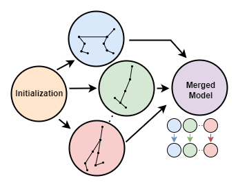

# Merging Decision Transformers: Weight Averaging for Forming Multi-Task Policies

<!-- <p align="left"> 
  
</p> -->

Code for [Merging Decision Transformers](https://arxiv.org/abs/2303.07551).

```
@misc{lawson2023merging,
      title={Merging Decision Transformers: Weight Averaging for Forming Multi-Task Policies}, 
      author={Daniel Lawson and Ahmed H. Qureshi},
      year={2023},
      eprint={2303.07551},
      archivePrefix={arXiv},
      primaryClass={cs.LG}
}
```

## Installation
Our code can be run using by installing the `Dockerfile` or through installing the dependencies in `env.yml`. 

### Downloads
Navigate to the `data` folder and run `python download_d4rl_datasets.py` to download MuJoCo [D4RL](https://github.com/Farama-Foundation/D4RL) datasets.

To utilize ChibiT as a model initialization, it can be downloaded by: `gdown --id 1-ziehUyca2eyu5sQRux_q8BkKCnHqOn1`, which should be unzipped and placed in a folder named ChibiT in the checkpoints folder. 

# Examples

## Merging w/ language initializations 

### Train model for each environment

```
python ./lm_cotraining/experiment.py --env {env_name} --dataset {dataset_name} --model_type dt -w --pretrained_lm ../checkpoints/chibiT --extend_positions --gpt_kmeans 1000 --gpt_kmeans_const 0.1 --device=cuda --kmeans_cache=../kmeans_cache/chibi_1000.pt --save_model --save_mode=best --dropout 0.1 --init_reg 1e-4
```

Where `env_name` is chosen from hopper, halfcheetah, or walker2d. 

### Merge & Finetune for each task

The below command merges three models over attn and mlp paramters, freezes merged parameters, and then finetunes on env_1. This finetuning process can be repeated seperately for each environment. Refer to `./decision_transformer/mergeff_tripple.py` and `./decision_transformer/mergeff_tripple_fish.py` for utilizing fisher information. 

``` 
python experiment.py -w --env {env_1} --dataset {dataset_1} --pretrained_models ./models/{env_1}/dt_gym-experiment-{model_1}_best.pt ./models/{env_2}/dt_gym-experiment-{model_2}_best.pt ./models/{env_3}/dt_gym-experiment-{model_3}_best.pt --num_eval_episodes=50 --max_iters=10 --num_steps_per_iter=10000 --include attn mlp --device=cuda --copy_model --merge_frozen
```

## Merging for improving multi-task models

### Training initial multi-task model

```
python experiment_multi.py --dataset medium --device=cuda --activation_function=gelu_new --max_iters=10 --num_steps_per_iter=10000 --save_model --save_mode=best --embed_dim=512 --n_head 4 -w
```

### Finetune seperately on each task

```
python experiment_multi.py --dataset {dataset} --device=cuda --activation_function=gelu_new --max_iters=10 --num_steps_per_iter=10000 --freeze_subset ln_f wpe embed_timestep --num_eval_episodes=50 --selected_training {env_name} --pretrained_model=./models/multi/dt_gym-experiment-multi-medium-{model_id}_best.pt -lr=1e-4 -w --init_reg=1e-4 --save_model --save_mode=best --custom_transformer_decay
```

Where `dataset` is chosen from medium-expert or expert, and selected_training chosen from hopper, halfcheetah, or walker2d. `model_id` is the id from the saved model in the first step. 

### Merge and evaluate multi-task model

```
python experiment_multi.py --dataset medium --norm_env=medium --device=cuda --activation_function=gelu_new --max_iters=1 --num_steps_per_iter=0 --num_eval_episodes=50 --eval_only --multi_pretrained_models ./models/multi/dt_gym-experiment-multi-expert-{id_1}_best.pt ./models/multi/dt_gym-experiment-multi-expert-{id_2}_best.pt ./models/multi/dt_gym-experiment-multi-expert-{id_3}_best.pt
```

Where `id_1, id_2, id_3` are the ids of the fineuned multi-task models for each seperate task. Additionally, `--use_fisher` should be enabled utilize fisher merging.  

## Pretrained Models
We provide pretrained models [here](https://drive.google.com/drive/folders/1VouKgw6q35NjbCeLLdg-eSKviLpqknsg?usp=sharing) for performing merging experiments. Models should be placed in folders ./decision-transformer/models/{env} where env is one of (halfcheetah, hopper  walker2d, multi). We may be able to provide additional models in the future or upon request. We describe each of the  models available below. 

### Randomly Initialized models
We provide 3 randomly initialized models trained with geglu activations for each environment.

medium:

halfcheetah-medium-282032: [WandB](https://api.wandb.ai/links/daniellawson9999/goitxycj)

walker2d-medium-343846: [WandB](https://api.wandb.ai/links/daniellawson9999/w6kdgpwu)

hopper-medium-278649: [WandB](https://api.wandb.ai/links/daniellawson9999/ude8st8x)

medium-expert:

halfcheetah-medium-expert-104977: [WandB](https://api.wandb.ai/links/daniellawson9999/dlsbgal6)

walker2d-medium-expert-599507: [WandB](https://api.wandb.ai/links/daniellawson9999/vke6y5dk)

hopper-medium-expert-706057: [WandB](https://api.wandb.ai/links/daniellawson9999/x1aq9ckj) 

### ChibiT Init Models

medium-expert:

halfcheetah-medium-expert-690101: [WandB](https://api.wandb.ai/links/daniellawson9999/gifgijd8)

walker2d-medium-expert-566085: [WandB](https://api.wandb.ai/links/daniellawson9999/njbe071t)

hopper-medium-expert-151557: [WandB](https://api.wandb.ai/links/daniellawson9999/fodub027)

### Multi-task models

We provide a multi-task model trained on medium quality data which can be used for the "Merging for improving multi-task models" experiment: 

medium-730023: [WandB](https://api.wandb.ai/links/daniellawson9999/4qghqz9q) (3 layer, 4 heads, 512 embed dim)


## Credit
Our implementation is based off https://github.com/kzl/decision-transformer and https://github.com/machelreid/can-wikipedia-help-offline-rl.


